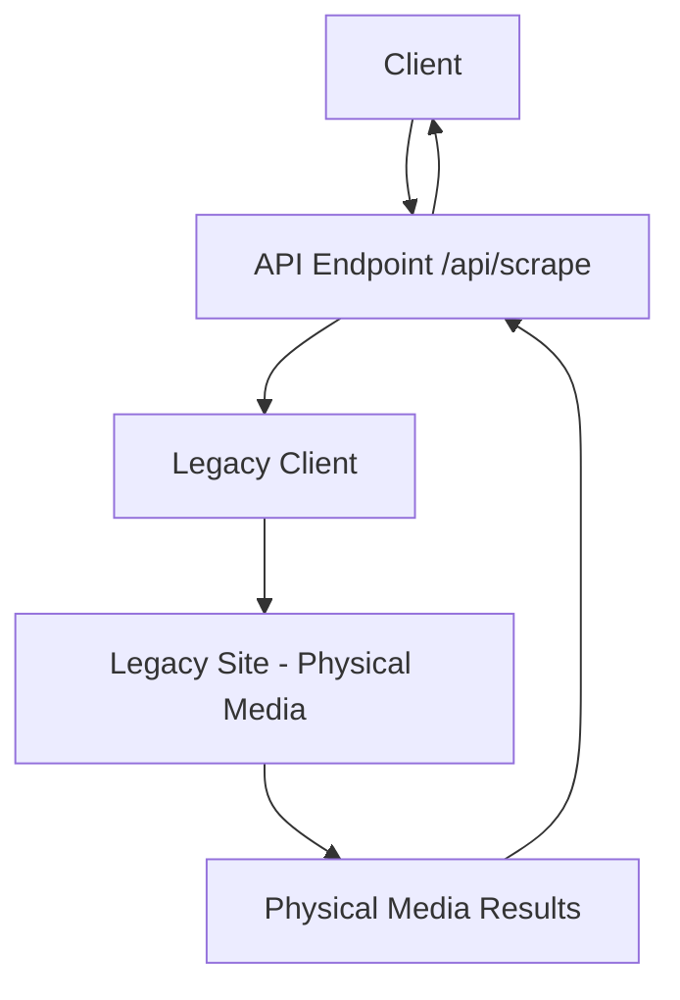
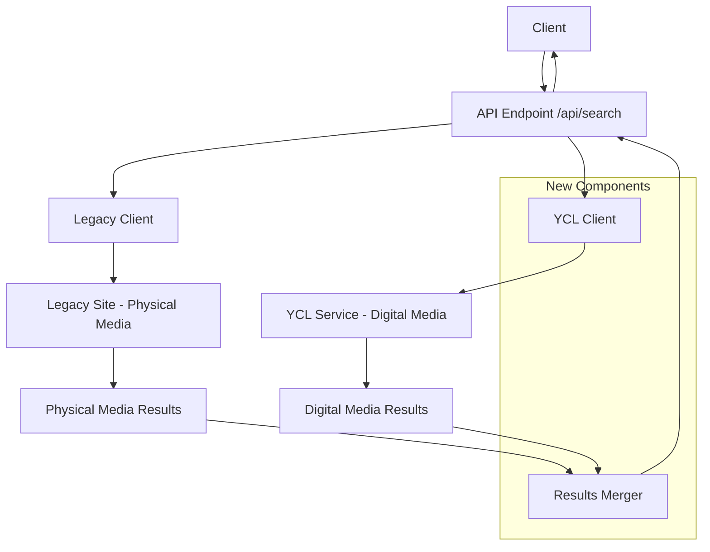

# Development Plan: Integrating Physical and Digital Media Search

## 1. Overview

The goal is to enhance the existing library stock search server by adding a new digital assets search capability and combining results from both sources. Currently, the system only provides search results for physical media from the legacy system. We need to integrate the YCL service to include digital assets (ebooks, etc.) in the search results.

## 2. Current Architecture



The current system:
- Exposes a single API endpoint `/api/scrape`
- Takes search query, username, password, and page parameters
- Uses Puppeteer to scrape the legacy site for physical media results
- Returns results in a structured format with pagination metadata

## 3. Proposed Architecture



The proposed system will:
- Maintain the existing `/api/scrape` endpoint for backward compatibility
- Add a new `/api/search` endpoint for the combined search
- Query both the legacy system and YCL service in parallel
- Merge and sort results based on relevance
- Implement unified pagination
- Allow filtering by media type (physical/digital/combined)
- Provide a new response structure with version parameter

## 4. API Design

### 4.1 New Endpoint: `/api/search`

**Request Parameters:**
- `search` (required): The search term
- `username` (required): Legacy system username
- `password` (optional): Legacy system password
- `librarySlug` (optional): YCL library identifier, if omitted digital search will be skipped
- `page` (optional, default: 1): Page number for unified pagination
- `pageSize` (optional, default: 10): Number of results per page
- `mediaType` (optional, default: "combined"): Filter type - "physical", "digital", or "combined"
- `sortBy` (optional, default: "relevance"): Sort order - "relevance", "availability", "title", etc.
- `version` (optional, default: "v2"): API response version - "v1" for legacy format, "v2" for new format

**Response Structure (v2):**
```json
{
  "meta": {
    "currentPage": 1,
    "pageSize": 10,
    "totalResults": 100,
    "totalPages": 10,
    "mediaTypeCounts": {
      "physical": 40,
      "digital": 60
    }
  },
  "results": [
    {
      "id": "unique-id",
      "title": "Book Title",
      "author": "Author Name",
      "description": "Book description...",
      "mediaType": "physical|digital",
      "imageUrl": "https://example.com/image.jpg",
      "availability": "Available|Checked Out|etc",
      "copies": 2,
      "format": "Book|eBook|Audiobook|etc",
      "source": "legacy|ycl",
      "sourceId": "original-id-in-source-system",
      "additionalDetails": {
        // Source-specific fields
      }
    },
    // More results...
  ]
}
```

### 4.2 Maintaining Backward Compatibility

The existing `/api/scrape` endpoint will be maintained for backward compatibility, continuing to return results in the current format.

## 5. Implementation Plan

### 5.1 Core Components

#### 5.1.1 YCL Service Integration

1. Create a new service class to handle YCL API interactions
2. Implement authentication and cookie management
3. Add search functionality that maps to the YCL catalogSearch method
4. Add result transformation to convert YCL format to our unified format

#### 5.1.2 Results Merger

1. Create a utility to merge results from both sources
2. Implement relevance-based sorting algorithm
3. Add unified pagination logic
4. Implement filtering by media type

#### 5.1.3 API Endpoint

1. Create the new `/api/search` endpoint
2. Implement parallel querying of both services
3. Add parameter validation and error handling
4. Implement response formatting with version support

### 5.2 Data Mapping

#### Physical Media (Legacy) to Unified Format:
```
BookInfo.title -> result.title
BookInfo.author/expandedAuthor -> result.author
BookInfo.description -> result.description
"physical" -> result.mediaType
BookInfo.bookJacketUrl -> result.imageUrl
BookInfo.availability -> result.availability
BookInfo.copies -> result.copies
"Book" -> result.format
"legacy" -> result.source
(generated) -> result.id
```

#### Digital Media (YCL) to Unified Format:
```
item.title -> result.title
item.authors[0] -> result.author
item.summary -> result.description
"digital" -> result.mediaType
item.imageLinkThumbnail -> result.imageUrl
(based on currentlyAvailable) -> result.availability
item.totalCopies -> result.copies
item.mediaType -> result.format
"ycl" -> result.source
item.id -> result.sourceId
```

## 6. Technical Considerations

### 6.1 Performance Optimization

1. **Parallel Processing**: Query both services simultaneously to minimize response time
2. **Caching**: Implement caching for frequent searches
3. **Pagination Efficiency**: Only fetch necessary data from each source based on the requested page

### 6.2 Error Handling

1. **Partial Results**: Return partial results if one service fails
2. **Graceful Degradation**: Fall back to legacy-only if YCL service is unavailable
3. **Detailed Error Reporting**: Provide clear error messages for troubleshooting

### 6.3 Authentication

1. **Cookie Management**: Handle YCL cookie authentication
2. **Credential Security**: Ensure secure handling of credentials
3. **Session Management**: Reuse sessions when possible to minimize authentication overhead

## 7. Implementation Phases

### Phase 1: Foundation
- Set up YCL client integration
- Create basic result merging functionality
- Implement the new endpoint with minimal features

### Phase 2: Core Features
- Add unified pagination
- Implement filtering by media type
- Add sorting options
- Create the new response format

### Phase 3: Optimization & Refinement
- Add caching
- Optimize performance
- Enhance error handling
- Add comprehensive logging

### Phase 4: Testing & Documentation
- Write unit and integration tests
- Create API documentation
- Perform load testing

## 8. File Structure Changes

```
src/
├── server.ts (modified to add new endpoint)
├── lw/ (existing legacy client)
├── ycl/ (existing YCL client)
├── services/
│   ├── legacyService.ts (refactored from existing code)
│   ├── yclService.ts (new)
│   └── searchService.ts (new - combines results)
├── models/
│   ├── unifiedResult.ts (new)
│   ├── legacyResult.ts (existing)
│   └── yclResult.ts (new)
├── utils/
│   ├── resultMapper.ts (new)
│   ├── pagination.ts (new)
│   └── sorting.ts (new)
└── middleware/
    ├── errorHandler.ts (new)
    └── validator.ts (new)
```

## 9. Testing Strategy

1. **Unit Tests**: Test individual components (services, mappers, etc.)
2. **Integration Tests**: Test the combined functionality
3. **API Tests**: Verify endpoint behavior with different parameters
4. **Performance Tests**: Ensure the system handles load efficiently
5. **Backward Compatibility Tests**: Verify the existing endpoint still works as expected

## 10. Potential Challenges and Mitigations

| Challenge | Mitigation |
|-----------|------------|
| Different data formats between systems | Create robust mapping utilities with fallbacks for missing fields |
| Performance impact of querying multiple sources | Implement parallel processing and caching |
| Pagination complexity with merged results | Design a unified pagination algorithm that handles both sources efficiently |
| Authentication failures | Implement retry mechanisms and clear error reporting |
| Maintaining backward compatibility | Thorough testing of existing functionality after changes |

## 11. Future Enhancements

1. **Advanced Filtering**: Add more sophisticated filtering options
2. **User Preferences**: Allow users to save preferred media types
3. **Relevance Tuning**: Improve the relevance algorithm based on user feedback
4. **Additional Media Sources**: Design for easy integration of more sources in the future
5. **Analytics**: Add usage tracking to understand search patterns

## 12. Conclusion

This development plan outlines a comprehensive approach to integrating physical and digital media search capabilities. By following this plan, we can create a unified search experience that provides users with access to both physical and digital resources while maintaining good performance and backward compatibility.

The implementation will be modular, allowing for future enhancements and the addition of more media sources as needed. The API design provides flexibility through filtering and sorting options, giving users control over their search experience.